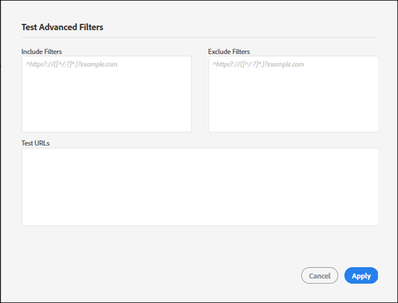

# Nieuwe controle maken{#create-a-new-audit}

>[!NOTE]
>
>De gebruikers zijn beperkt tot één controle die tegelijkertijd loopt. Er treedt een fout op als u een controle probeert te starten met dezelfde instellingen als de controle die wordt uitgevoerd. U kunt de koppeling in het foutbericht gebruiken als u de audit die momenteel wordt uitgevoerd wilt annuleren, zodat u een nieuwe kunt maken.

Gebruik desgewenst de koppeling onder aan de pagina om toegang te krijgen tot een gratis, volledig uitgeruste proefaccount met ObservePoint.

1. Klik in de lijst Auditor op **[!UICONTROL New Audit]**.

   Het [!DNL New Audit] scherm wordt geopend.

   

1. (Vereist) Geef de audit een naam.

   De naam mag maximaal 250 tekens lang zijn.
1. (Vereist) Geef de eerste URL op.

   Het protocol wordt vereist wanneer het specificeren van beginnende URL. De beginnende URL is de pagina waar de controle begint kruipend. Zodra begonnen, kruipt de Auditor tot 500 pagina&#39;s, na verbindingen die bij de beginnende URL beginnen. Zie Filters [opnemen en uitsluiten](../create-audit/filters.md#concept-23531490bb124981ba807ed1806e3257) voor meer informatie. De eerste URL kan maximaal 250 tekens lang zijn.

   >[!NOTE]
   >
   >In sommige gevallen kan het 48 uur duren voordat een scan van 500 pagina&#39;s is voltooid.

1. Geef een of meer e-mailadressen op voor meldingen over deze controle.

   U kunt meerdere e-mails opgeven door elk adres te scheiden met een komma. De aanvrager wordt standaard op de hoogte gesteld. E-mailadressen worden in real-time gevalideerd. Als u een ongeldig adres ingaat, wordt uw op het scherm op de hoogte gebracht.

   Elke e-mail is beperkt tot maximaal 250 tekens, inclusief het einde van het domein (bijvoorbeeld .com).
1. Geef Inclusief filters op.

   Dit veld kan exacte URL&#39;s, gedeeltelijke URL&#39;s of reguliere expressies bevatten. Gebruik dit veld voor criteria waaraan elke URL moet voldoen. Eventuele gekropen URL&#39;s die niet overeenkomen met de criteria voor Inclusief filter, worden niet opgenomen in de auditresultaten.

   U zou folders kunnen ingaan u de controle wilt aftasten. Of, kunt u dwars-domein of zelfverwijzingscontrole uitvoeren, waar u de controle op één domein moet beginnen en op een ander beëindigen. Typ hiertoe de domeinen die u wilt doorlopen. voor complexe URL-patronen gebruikt u een reguliere expressie.

   >[!NOTE]
   >
   >Als u een pagina in uw filters opneemt, maar deze niet is verbonden met de eerste URL, of de controleur scant 500 pagina&#39;s voordat deze pagina wordt bereikt, wordt de pagina niet gescand en wordt deze niet opgenomen in de testresultaten.

   De include-filters zijn beperkt tot 1000 tekens per regel.

   Zie Lijst  opnemen voor meer informatie.
1. Geef filters voor uitsluiten op.

   De lijst met uitsluitingen voorkomt dat URL&#39;s worden gecontroleerd. Gebruik exacte URL&#39;s, gedeeltelijke URL&#39;s of reguliere expressies, net als in de lijst Opnemen.

   Een gebruikelijke manier is om een logout-koppeling uit te sluiten als de audit een gebruikerssessie heeft (bijvoorbeeld: `/logout`, dat wil zeggen elke URL die de tekenreeks bevat `/logout`).

   De uitsluitingsfilters zijn beperkt tot 1.000 tekens per regel.

   Zie Lijst  uitsluiten voor meer informatie.
1. (Optioneel) U kunt desgewenst de include- en uitsluitingsfilters testen en uw URL&#39;s testen.

   Voer de filters en URL&#39;s in en klik vervolgens **[!UICONTROL Apply]** om de test uit te voeren.

   

1. Klik op **[!UICONTROL Run Report]**.
