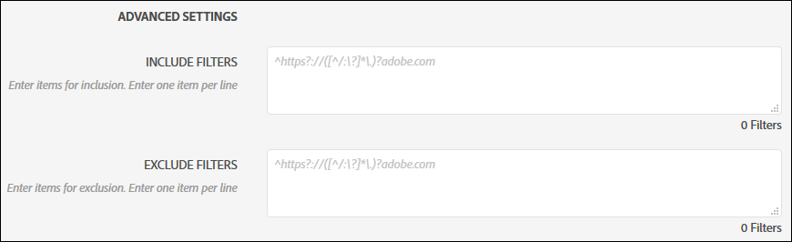
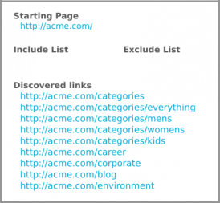
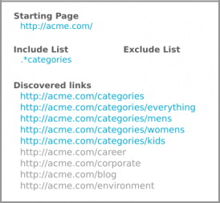
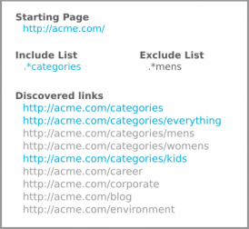
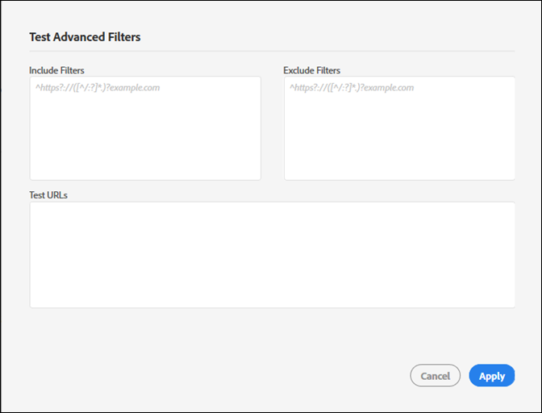

# Filters opnemen en uitsluiten{#include-and-exclude-filters}

Met Inclusief filters bepaalt u welke koppelingen een controle kan doorlopen vanaf de eerste URL. Met filters uitsluiten kan een controle koppelingen niet crawling.

<!--
Content from ObservePoint (https://help.observepoint.com/articles/2872121-include-and-exclude-filters) with their permission. Modified slightly for style and Auditor emphasis.
-->

Met filters opnemen en filters uitsluiten geeft u richtlijnen voor audits. Door de filters Opnemen en Uitsluiten leeg te laten, kan een controle om het even welke verbindingen kruipen het tegenkomt, beginnend met verbindingen op de Beginnende URL.



Door Include filters, de filters van de Uitsluiting, of een combinatie beide toe te passen, kunnen de instructies betreffende welke verbindingen een controle kruipen worden gegeven.

Om het even welk punt in het Include gebied van Filters beperkt het aftasten tot slechts de pagina&#39;s die dat punt aanpassen. Elk item in het veld Filters uitsluiten voorkomt dat pagina&#39;s die overeenkomen met dat item worden gescand.

De filters Opnemen en Uitsluiten kunnen volledige URL&#39;s, gedeeltelijke URL&#39;s of reguliere expressies zijn die overeenkomen met een geldige pagina.

## Rangorde {#section-e9d42419dd3f459bb20e7a33c6104f12}

1. **Het beginnen van URL** neemt belangrijkheid over al ander en zal altijd tijdens een controle worden bezocht, zelfs als een URL een punt in de filters van de Uitsluiting aanpast. De eerste URL wordt altijd vóór andere URL&#39;s bezocht.

   

   In de bovenstaande afbeelding worden koppelingen gevonden van de `document.links` eigenschap van de startpagina. Deze verbindingen kunnen door de controle worden gescand.

1. **Opnemen van URL&#39;s** moet zijn gekoppeld vanaf een startpagina, anders kunnen ze niet worden gedetecteerd en worden ze niet bezocht.

   

   In de bovenstaande afbeelding worden door het toevoegen van een Include-filter de URL&#39;s die in aanmerking komen, beperkt tot de URL&#39;s die overeenkomen met het filter. Nu kunnen slechts vijf verbindingen door de controle worden gescand.

1. **Met URL&#39;s** uitsluiten worden koppelingen niet meer in aanmerking genomen.

   

   Als u in de bovenstaande afbeelding een filter Uitsluiten toevoegt, voorkomt u dat URL&#39;s in aanmerking komen voor koppelingen. Nu kunnen slechts drie koppelingen door de audit worden gescand.

## URL starten {#section-ccb46abcd96f4a8ab171245015d2b724}

De controleur vereist één enkele pagina voor het Begin URL. De eerste URL wordt altijd vóór andere URL&#39;s bezocht. Koppelingen die vanaf de startpagina worden ontdekt, kunnen worden bezocht, afhankelijk van de filters Opnemen en Uitsluiten. Als een item voor uitsluiten overeenkomt met een starteURL, wordt dit item genegeerd.

## Inclusief filters {#section-7626060a56a24b658f8c05f031ac3f5f}

Met de Include-filters beperkt u welke koppelingen tijdens een controle kunnen worden gescand. Inclusief filters kunnen:

* Volledig gekwalificeerde URL&#39;s
* Gedeeltelijke URL
* Gewone expressies die overeenkomen met volledige of gedeeltelijke URL&#39;s
* Elke combinatie van bovenstaande

Als u URL&#39;s of reguliere expressies toevoegt aan het filter Opnemen, is het niet zeker dat deze specifieke URL&#39;s in de controle worden gescand. De controle inspecteert de verbindingen op het Begin URL, dan navigeert door de in aanmerking komende verbindingen. De controle gaat door met het inspecteren en navigeren totdat de limiet van 500 gescande URL&#39;s is bereikt of totdat geen in aanmerking komende koppelingen meer zijn gevonden.

>[!NOTE]
>
>In sommige gevallen kan het 48 uur duren voordat een scan van 500 pagina&#39;s is voltooid.

Standaard worden alle subdomeinen van de eerste URL door een controle gescand. Tenzij dit expliciet wordt overschreven door een include-filter op te geven, gebruikt de scan de volgende regex inclusief filter:

`^https?://([^/:\?]*\.)?mysite.com`

Hierdoor kan elke koppeling die op de startpagina van de URL wordt gevonden, worden bezocht. Deze komt overeen met elke pagina in elk subdomein van de URL die wordt gestart.

Het gebruiken van het gebrek omvat filter verstrekt een brede waaier voor een controle om te kruipen. Als u in bepaalde secties of pagina&#39;s wilt gaan werken, geeft u specifieke aanwijzingen voor de controle door filters toe te voegen in dit vak. In dat geval vervangt u de standaardwaarde door de directory&#39;s die de controle moet scannen. U kunt ook filters gebruiken om interdomeincontrole uit te voeren waar u de controle op één domein moet beginnen en op een andere beëindigen. Typ hiertoe de domeinen die u wilt doorlopen. Als u URL&#39;s voor Include-filters wilt vinden, moeten deze in elk geval worden gevonden op een pagina die wordt gecontroleerd.

De Include Filters kunnen nauwkeurige URLs, gedeeltelijke URLs, of regelmatige uitdrukkingen bevatten. Als de URL voor het starten bijvoorbeeld is [!DNL http://mysite.com], kunnen de volgende pagina&#39;s standaard worden gescand (let op de vetgedrukte tekens):

```html
http://mysite.com
http
<b>s</b>://mysite.com
http://
<b>www</b>.mysite.com/home
http://
<b>dev</b>.mysite.com/home
http://
<b>my</b>.mysite.com/products/products_and_services.html
```

Gebruik voor complexe URL-patronen de reguliere-expressietestster van [ObservePoint](https://regex.observepoint.com/).

## Filters uitsluiten {#section-00aa5e10c878473b91ba0844bebe7ca9}

De filters van de Uitsluiting verhinderen URLs worden gecontroleerd. U kunt exacte URL&#39;s, gedeeltelijke URL&#39;s of reguliere expressies gebruiken. URL&#39;s die overeenkomen met een item in de filters Uitsluiten worden niet bezocht. Als de startURL is opgenomen in de filters Uitsluiten, wordt deze niet uitgesloten. De eerste URL wordt altijd gescand door een controle.

## Filters en URL&#39;s testen {#section-3cfa125b1756411395a64701e128efa0}

U kunt uw filters en URLs binnen Auditor testen.

Klik tijdens het maken van de controle op **[!UICONTROL Test Advanced Filters]**. Voer de filters en URL&#39;s in en klik op **[!UICONTROL Apply]**.



## Documentatie voor observerpunt {#section-79cdc8e850d047969b6d2badf6bbd6f9}

Dit artikel is ontwikkeld in samenwerking met ObservePoint. Raadpleeg de documentatie [van]ObservePoint (https://help.observepoint.com/) voor de meest recente informatie.
