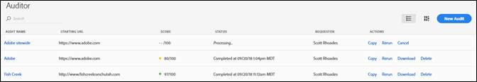
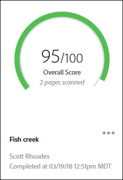
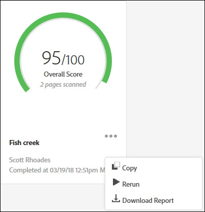

# Pagina met controlelijsten{#audit-list-page}

De pagina van de Lijst van de Controle toont informatie over al uw controles.

Wanneer u Adobe Experience Platform Auditor start, wordt de pagina Auditlijst weergegeven. U kunt de pagina van de Lijst van de Controle als of een lijst of een kaartmening bekijken.

## Lijstweergave {#section-a428749d2ab94a08bf460e6a486b844a}

De mening van de lijst toont de volgende informatie voor elk van uw controles.

| Item | Beschrijving |
|---|---|
| Auditnaam | De naam die aan de controle is gegeven |
| URL starten | De URL waar de controle begint uw pagina&#39;s kruipen |
| Score | Audits hebben een score van 1 tot 100, wat betekent dat er geen problemen zijn op de gescande pagina&#39;s |
| Status | Toont wanneer de controle werd voltooid of dat het wordt verwerkt |
| Aanvrager | Toont de naam van de gebruiker die de controle creeerde |
| Acties | Verzekert verbindingen voor het kopiëren of het opnieuw opstarten van de controle, het annuleren van een controle die momenteel loopt, het downloaden van een rapport als [!DNL Excel] spreadsheet, of het schrappen van de controle |

Klik op de naam van de controle om de controleresultaten weer te geven.

## Kaartweergave {#section-6826b585e53a46daa722b9bd3eda926e}

In de kaartweergave wordt elke controle in een grafische indeling weergegeven.

Klik op de naam van de controle om de controleresultaten weer te geven. Klik op het menu naast de naam om koppelingen weer te geven voor het kopiëren, opnieuw uitvoeren of annuleren van de controle of om een voltooid rapport te downloaden als een [!DNL Excel] spreadsheet of PDF.

