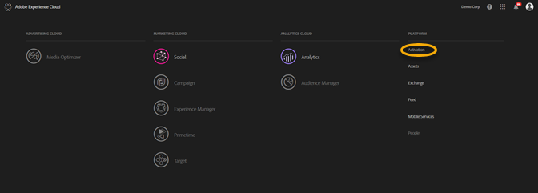
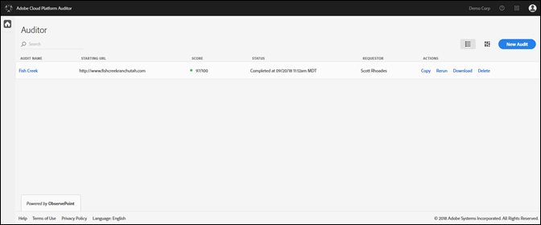
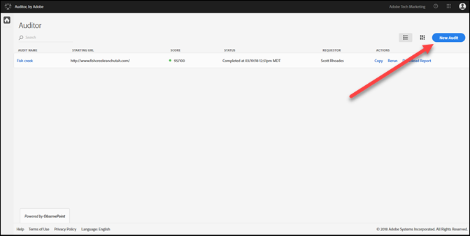
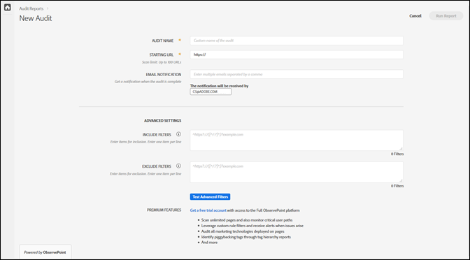
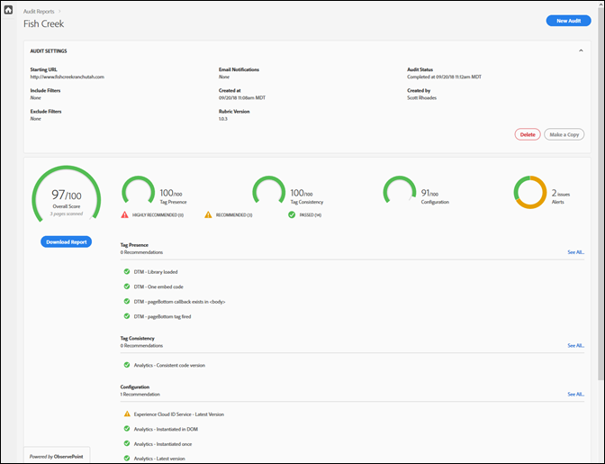

# Aan de slag{#getting-started}

## Aan de slag {#task-1024e94b5948413295c9698e62165a04}

<!--
This page is a placeholder for now, we need things like prerequisites, any planning that should be done before using Auditor, initial setup info--that kind of thing.
-->

De eerste keer dat u Auditor gebruikt, moet u de Auditor-overeenkomst voltooien en accepteren. Auditor is ontwikkeld als een samenwerkingsproject tussen Adobe en ObservePoint. Auditor-gebruikers kunnen de beperkte ObservePoint-functionaliteit zonder extra kosten gebruiken. Om Auditor te gebruiken, moet u opt-in aan mededelingen van ObservePoint.

## De eerste scan uitvoeren {#task-b211597afed343cfa238443fcf7c6041}

1. Klik op de menuknop in de rechterbovenhoek van de Adobe Experience Cloud-navigatiebalk en klik op **[!UICONTROL Activation]**.

   

1. Selecteer Auditor en ga akkoord met de Gebruiksvoorwaarden.

   De pagina Auditor biedt u een dashboard met vorige scans, samen met de optie om een nieuwe scan uit te voeren.

   

1. Klik op **[!UICONTROL New Audit]**.

   Als u een nieuwe scan wilt uitvoeren, klikt u **[!UICONTROL New Audit]** in de rechterbovenhoek van het scherm.

   

1. Scan configureren.

   Geef een naam op voor de controle, geef een begin-URL op en klik op **[!UICONTROL Run Report]**. Nadat de scan is voltooid, ontvangt u een e-mailmelding.

   

   Voor een beschrijving van alle configuratieopties, zie een Nieuwe Controle creëren.
1. Bekijk uw rapport.

   Wanneer u de e-mail ontvangt die u laat weten het aftasten volledig is, klik op de verbinding om uw rapport [te](../reports/scorecard.md) bekijken en mogelijkheden beginnen te begrijpen om uw implementatie te verbeteren en meer waarde van uw oplossingen van de Adobe te bereiken.

   U kunt ook op de naam van de controle op de pagina  Auditor klikken om de status van de controle te zien en het rapport te bekijken nadat de audit is voltooid.

   
