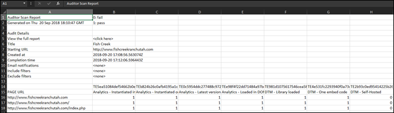

# Rapport downloaden{#download-report}

Het rapport toont of elke URL overgaat of ontbreekt.

Het rapport kan op de Scorecard pagina in het gebruikersinterface worden bekeken. U kunt het rapport ook downloaden:

1. Klik in de lijst Auditor of op een scorecard op **[!UICONTROL Download Report]**.

   U kunt het rapport downloaden als spreadsheet of Pdf- dossier.
1. Geef op of u het bestand wilt openen of opslaan.

1. Klik op **[!UICONTROL OK]**.

   In het werkblad wordt aangegeven of elke test op elk van uw pagina&#39;s is geslaagd of is mislukt.

   

De PDF bevat de volgende informatie:

* Instellingen voor de controle
* Tijdstempel voltooien
* Totale score
* Score per categorie
* Eenheidstests toegepast met URL&#39;s die zijn mislukt
* Aanbevelingen en documentkoppeling Help per test
