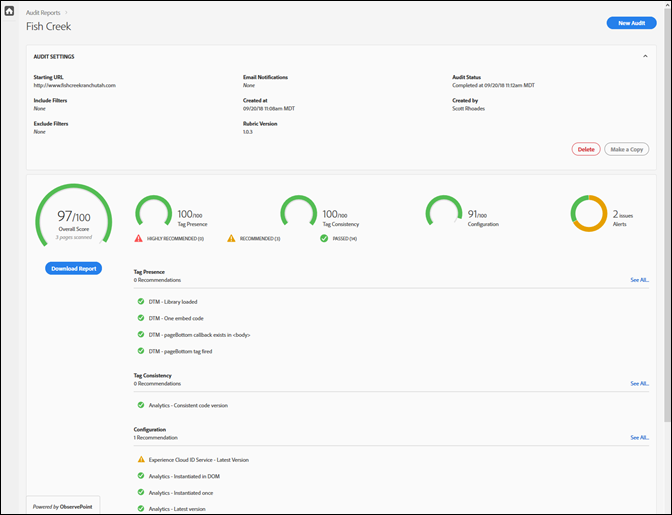
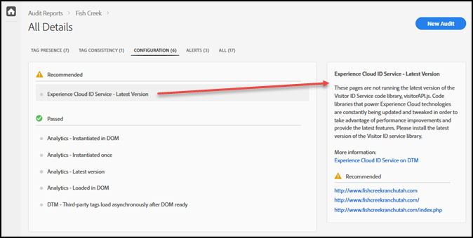

# Scorecard{#scorecard}

Nadat u een test in werking stelt, toont scorecard informatie over een controle.

Klik op de naam van uw controle op de pagina Auditor om de resultaten van uw test weer te geven.

Gebruik scorecard om te zien hoe de controle in de volgende categorieën scoorde:

* Totale score
* Tagaanwezigheid

   Evalueert of de tag bestaat en of deze zich op de juiste plaats in de paginacode bevindt.
* Codeconsistentie

   Evalueert of de tags consistent zijn in alle URL&#39;s.
* Configuratie

   Evalueert de tags aan de hand van andere regels en aanbevolen aanbevolen procedures.
* Waarschuwing

   Waarschuwingen tonen problemen waarvan je op de hoogte moet zijn, maar die geen invloed hebben op je score.

Uw score hangt af van het gewicht van elke test en of u slaagt of niet. Als u slaagt, neemt de score toe met het aantal punten dat gelijk is aan het testgewicht.

* 0: Hiermee wordt u gewaarschuwd voor problemen waarvan u op de hoogte moet zijn, maar die geen invloed hebben op uw score.
* 1: adviseert een optimalisering. Geen invloed op de gegevensnauwkeurigheid.
* 2: Als u deze test niet uitvoert, hebt u geen toegang tot de nieuwste functies en oplossingen in de Adobe Experience Cloud.
* 3: Test op efficiëntie en of de implementatie voldoet aan de aanbevolen best practices.
* 4: Als dit mislukt, worden mogelijk onbetrouwbare gegevens verzameld.
* 5: Als dit mislukt, ziet u mogelijk gegevensverlies.

De scorecard maakt een lijst van om het even welke niveau 4 of 5 kwesties als **hoogst geadviseerd** die u bevestigt.

De scorecard maakt een lijst van om het even welke niveau 1 tot 3 kwesties zoals **geadviseerd** die u bevestigt.

Klik op **[!UICONTROL Download the Report]** om een Excel- of PDF-bestand te downloaden dat de informatie bevat die door de controle wordt gerapporteerd.

Naast de score voor elke categorie, maakt een lijst van scorecard van om het even welke moeilijke situaties die worden geadviseerd of hoogst geadviseerd, evenals de punten die de test met succes bekritiseerden. Klik op elk probleem om meer details in het vak rechts te zien. Klik nogmaals om verder naar beneden te boren en aanbevelingen te bekijken over hoe u het probleem kunt oplossen. Het volgende toont de details voor een Aanbevolen kwestie in hierboven getoonde scorecard:

Klik op de categorieën boven aan het scherm om de problemen in elke categorie weer te geven.

## Welke pagina&#39;s maakten deel uit van de test? {#section-fd38ffeb868648e89c34c5772fa65f46}

U kunt lijsten weergeven van de URL&#39;s die tijdens de test zijn geslaagd of mislukt.

Klik in het scorebord op een testnaam of de **[!UICONTROL See All]** koppeling onder elke koptekst van de categorie. Dit brengt u naar de details van de tests. Voor elke test, kunt u de testbeschrijving en een lijst van om het even welke URL zien die ontbrak en geslaagd. Deze informatie wordt ook opgenomen in gedownloade rapporten.
